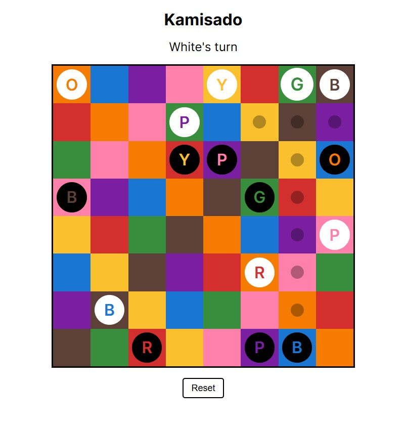

# kamisado

<table>
    <tr>
        <td style="vertical-align: top; max-width: 550px;">
            Web version of the board game Kamisado (single round variant)
             
             
            Only supports local multiplayer.
             
             
            Read the rules <a href="https://www.ultraboardgames.com/kamisado/game-rules.php">here</a>
        </td>
        <td>
            
        </td>
    </tr>
</table>

## Like this project?

If you find this project interesting or useful, consider giving it a star ⭐️!

## License

This project is licensed under the MIT License. See [LICENSE](LICENSE) for more information.
